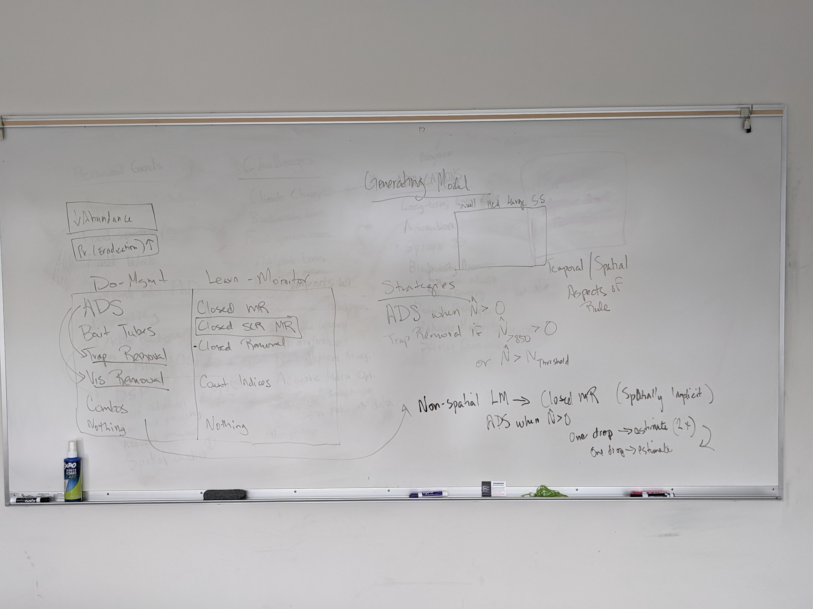

```{r setup, include=FALSE}
knitr::opts_chunk$set(echo = TRUE)
```

### 10/27/2022

#### Notes from 10/26 meeting with Sarah and Staci

-   Nothing really needs to be done by the Guam trip (good)

-   first step, build a size-structured population model, with 4 size classes (small, medium, large, super large), and associated survival and reproductive rates

    -   On this population, do iterations of one-time removal, then estimate and keep doing this until a rule (N \> 10, for example) is broken (so, once the population goes below 10, it would stop)

    -   Try different starting population sizes to see if there's a big difference in the results

    -   Quarterly time step (3 months)

    -   Could have a density dependence function as part of the growth and reproductive rates

-   Start in R, may need to move to JAGS later

-   The adaptive part might be to test for management control effectiveness, and adjust based on that

-   Try to have a full basic model by the end of November

-   January and April 15th are the quarterly report deadlines (Staci will send me examples, it isn't hard)

    -   Ask Sarah R. for remaining budget numbers with at least a week of leeway for her to get back to me



### Notes from Guam trip 11/14/22 - 11/19/22

#### Misc Notes & Thoughts

-   Traps and visual surveys need different amounts of transect cutting (vis \> trap)

-   Drops of toxicants currently happens every 2 months, 2 drops each time

-   When scaling up removals, it will at some point be impossible to monitor (because of money constraint) so we need to know that the removal method is reliable through population change

-   Everyone in DOD wants to come to Guam right now, so access will be constricting in the future

-   Encounter probability for air drops seems likely to be dependent on snake density (no method to evaluate this at the moment, I don't think)

    -   Maybe trapping encounter probability too, but this might be easier to evaluate

-   Removals with no counts might have to be interspersed with monitoring, or a different method with counts in order to get any kind of abundance estimates

-   ADS (air delivery system, aerial toxic bait dispersal method) might be cheaper now (one less person in helicopter)

-   Would it be useful to separate abundance estimation from spatial distribution? (similar to what they do for groundfish)

-   Could add kill traps into simulation, even if we don't know how effective they'll be

    -   Ask Amy if this would be a good idea - at the least, it might mean just designing the model to make it simple to add another eradication method

-   Prey abundance may need to be a factor in removal methods (traps for sure, Shane's work on Cocos proved that they really don't go in traps if prey is abundant)

-   Could dogs be used in the forest to create some kind of indirect density index?

    -   Still not useful for inaccessible areas, but it might be interesting to discuss

-   Another indirect detection method (although I don't know if it could be used for density, maybe just presence) that is being explored is using eDNA - samples have been collected but haven't been analyzed yet

-   Another option for indirect detection is monitoring prey populations - prey availability should be in the model anyway, so this could be manipulated to simulate re-introductions occurring (prey abundance suddenly going up)

#### Research Committee meeting notes

-   We need a model that can use fairly continuous removal data (current model that exists has closed and open populations, which goes iteratively thru time)

-   They're working on diet analysis research right now for Cocos snakes, using both isotopes (are the diets roughly the same or different for snakes in Cocos vs the mainland) and DNA (actually identifying the species)

    -   Is there a way this kind of data could be used to monitor during removals?

-   A future removal option might be adding mesh nets to entangle snakes (not sure exactly how to operationalize this yet)

-   Pheromone attractants don't work for BTS - this research wasn't published in a journal because it was a null result, but it is in a report in grey literature somewhere

    -   Grey literature really needs to be indexed (this was discussed, but no one will stepped up to take it on)

-   The research and management arms of the BTS project have historically been separate (done by different agencies), and there is recognition that this needs to be more integrated now

-   Is there a master list of all of the BTS research and management efforts across time? Ideally contextualized by goal & connections between projects (I assume not, but it would be great - they need a historian)

-   What is the criteria used by the research committee for internal project prioritizations? (that hasn't been detailed in the discussion yet)

    -   I asked Amy later, there is no agreed upon prioritization criteria

    -   There is a strategic plan (I asked Amy to send it to me - FOLLOW UP WITH AMY ABOUT THIS)

-   Value mapping would be a valuable exercise for this group

#### Annual Public meeting notes

-   Lots of organizational re-organizing and shifting that has occurred recently will likely affect eradication efforts

-   I need to take this opportunity to ask folks about what would be useful to get out of my simulation study

    -   I didn't really have a chance to do that there, but now I could. Priority of folks to ask:

        -   Gregg Howald - specifically, could my work be used in the Cocos eradication at all

        -   MJ - as the BTS coordinator, she might have th most over-arching view

        -   Management folks - USDA, maybe Guam state folks; maybe ask Amy who she would suggest I talk to

-   "Office of Insular Affairs"; look up

    -   Priorities for runding in 2023 were announced

-   Robustness might be one of the biggest things; if our knowledge or information is wrong or incomplete, will it still likely work (for either eradication or suppression)

-   USGS building new facilities in Hawaii; maybe watch for jobs there

-   BTS was first found on Cocos in 2020 (and now its projected there are a couple hundred or so)

-   Is it possible to age snakes independent of size? (Since size is influenced by health, it seems like)

    -   Simple answer is no

    -   Regardless, this would only be useful for removal methods where there is a body

-   Spatz et al. 2022 - island removals, look up; also deWitt et al. 2020

-   One principle of eradication: "don't educate target animals to eradication techniques"; wonder if this is happening on Guam, especially with the aerial delivered baits

-   "Rights holder" as opposed to (or in addition to) "stakeholder" - would definitely be more accurate for some instances

-   Siers et al. 2022 - Limitations of Eradication Tools w/ abundant prey (look up)

-   In my simulations, the threshold needs to be 0 snakes detected for multiple time steps (not just one)

    -   Ask Amy how they've determined a closed site to be fre of BTS in past experiments

        -   This has only been done once, and it wasn't really standardized, so may need to come up with something

-   Look up Freshwater Life, and Gregg Howald - might want to do an informational interview (or something) with him

    -   I basically did this, but definitely should get in touch again

-   There's a current project moving forward that will test how aerial drops do within a large, unfenced area (55 ha) in terms of eradication

-   Look up Nafus et al 2021; paper concluded that aerial drops alone would take a long time to reach eradication

-   Brown treesnakes are fairly unique in that they'll attach and kill things that are too big for them to injest

    -   May be important because small snakes may kill birds even if they can't eat them

#### Business meeting notes

-   Question to keep in mind: What does the last snake look like? Small, skinny...? On private land?

-   Interdiction research isn't really being done - there have been no requests for data collection from the folks doing the interdiction work (and this could be done relatively easily)

    -   Could this data be used as an indication of density? Depending on how many sites are consistently being patrolled, maybe if they're fairly spread out across the island it might be particularly useful

-   No longer need co-pilots in the helicopter for aerial suppression; this will decrease the cost of that method

    -   Figure out how much less - will probably need to ask someone

-   Tano Tasi ya Todu - nonprofit to look up

-   2020 - 2025 strategic plan created 3 new committees

-   Look for social studies research related to invasive species

-   Key performance indicators for the BTS Technical Working Group:

    -   Four focal areas: control and eradicate, interdiction and early detection, research and education/outreach

    -   Metrics for interdiction:

        -   On Guam:

            -   Total takes & captures by location

            -   Inspection rate

            -   Training/evaluation certification

            -   Locations of interdiction activities

        -   Off of Guam:

            -   Port of entry trapping effort

            -   Number of port of entry inspections

            -   Cocos Island rapid response: effort & number removed

    -   Metrics for control and eradication:

        -   Hectares of control area & location

        -   Funding amount & sources

    -   Metrics for research:

        -   Amount & source of funding

        -   Recipients of funding & amounts

        -   Focal areas & amounts

        -   "Impact values" - what research is intended to do

    -   Metrics for education/outreach:

        -   List of events

        -   Social media & press metrics

        -   Number of contacts from outreach events by agency

        -   Number of volunteer events by agency

-   Maybe BTS doesn't need to be completely eradicated; in this case, how much does the population need to be suppressed? "Effective eradication"

    -   A risk assessment would be useful before introductions are done

-   Are all of the birds equally valuable to restore? Or are some more ecologically or culturally important?

### 11/30/2022

#### Notes from Meeting with Staci & Sarah

-   refer to Amy's paper for eradiction threshold ideas (Staci sent it to me)

-   For growth rate, use a half normal distribution, with the highest growth level (the mean, I think?) at lowest density, and growth rate decreasing as density goes up

```{r half-normal_example}

```
