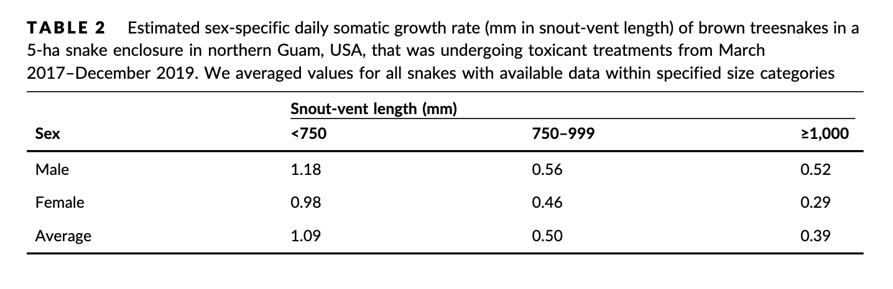

```{r setup, include=FALSE}
knitr::opts_chunk$set(echo = TRUE)
```

### 10/27/2022

#### Notes from 10/26 meeting with Sarah and Staci

-   Nothing really needs to be done by the Guam trip (good)

-   first step, build a size-structured population model, with 4 size classes (small, medium, large, super large), and associated survival and reproductive rates

    -   On this population, do iterations of one-time removal, then estimate and keep doing this until a rule (N \> 10, for example) is broken (so, once the population goes below 10, it would stop)

    -   Try different starting population sizes to see if there's a big difference in the results

    -   Quarterly time step (3 months)

    -   Could have a density dependence function as part of the growth and reproductive rates

-   Start in R, may need to move to JAGS later

-   The adaptive part might be to test for management control effectiveness, and adjust based on that

-   Try to have a full basic model by the end of November

-   January and April 15th are the quarterly report deadlines (Staci will send me examples, it isn't hard)

    -   Ask Sarah R. for remaining budget numbers with at least a week of leeway for her to get back to me


### Notes from Guam trip 11/14/22 - 11/19/22

#### Misc Notes & Thoughts

-   Traps and visual surveys need different amounts of transect cutting (vis \> trap)

-   Drops of toxicants currently happens every 2 months, 2 drops each time

-   When scaling up removals, it will at some point be impossible to monitor (because of money constraint) so we need to know that the removal method is reliable through population change

-   Everyone in DOD wants to come to Guam right now, so access will be constricting in the future

-   Encounter probability for air drops seems likely to be dependent on snake density (no method to evaluate this at the moment, I don't think)

    -   Maybe trapping encounter probability too, but this might be easier to evaluate

-   Removals with no counts might have to be interspersed with monitoring, or a different method with counts in order to get any kind of abundance estimates

-   ADS (air delivery system, aerial toxic bait dispersal method) might be cheaper now (one less person in helicopter)

-   Would it be useful to separate abundance estimation from spatial distribution? (similar to what they do for groundfish)

-   Could add kill traps into simulation, even if we don't know how effective they'll be

    -   Ask Amy if this would be a good idea - at the least, it might mean just designing the model to make it simple to add another eradication method

-   Prey abundance may need to be a factor in removal methods (traps for sure, Shane's work on Cocos proved that they really don't go in traps if prey is abundant)

-   Could dogs be used in the forest to create some kind of indirect density index?

    -   Still not useful for inaccessible areas, but it might be interesting to discuss

-   Another indirect detection method (although I don't know if it could be used for density, maybe just presence) that is being explored is using eDNA - samples have been collected but haven't been analyzed yet

-   Another option for indirect detection is monitoring prey populations - prey availability should be in the model anyway, so this could be manipulated to simulate re-introductions occurring (prey abundance suddenly going up)

#### Research Committee meeting notes

-   We need a model that can use fairly continuous removal data (current model that exists has closed and open populations, which goes iteratively thru time)

-   They're working on diet analysis research right now for Cocos snakes, using both isotopes (are the diets roughly the same or different for snakes in Cocos vs the mainland) and DNA (actually identifying the species)

    -   Is there a way this kind of data could be used to monitor during removals?

-   A future removal option might be adding mesh nets to entangle snakes (not sure exactly how to operationalize this yet)

-   Pheromone attractants don't work for BTS - this research wasn't published in a journal because it was a null result, but it is in a report in grey literature somewhere

    -   Grey literature really needs to be indexed (this was discussed, but no one will stepped up to take it on)

-   The research and management arms of the BTS project have historically been separate (done by different agencies), and there is recognition that this needs to be more integrated now

-   Is there a master list of all of the BTS research and management efforts across time? Ideally contextualized by goal & connections between projects (I assume not, but it would be great - they need a historian)

-   What is the criteria used by the research committee for internal project prioritizations? (that hasn't been detailed in the discussion yet)

    -   I asked Amy later, there is no agreed upon prioritization criteria

    -   There is a strategic plan (I asked Amy to send it to me - FOLLOW UP WITH AMY ABOUT THIS)

-   Value mapping would be a valuable exercise for this group

#### Annual Public meeting notes

-   Lots of organizational re-organizing and shifting that has occurred recently will likely affect eradication efforts

-   I need to take this opportunity to ask folks about what would be useful to get out of my simulation study

    -   I didn't really have a chance to do that there, but now I could. Priority of folks to ask:

        -   Gregg Howald - specifically, could my work be used in the Cocos eradication at all

        -   MJ - as the BTS coordinator, she might have th most over-arching view

        -   Management folks - USDA, maybe Guam state folks; maybe ask Amy who she would suggest I talk to

-   "Office of Insular Affairs"; look up

    -   Priorities for runding in 2023 were announced

-   Robustness might be one of the biggest things; if our knowledge or information is wrong or incomplete, will it still likely work (for either eradication or suppression)

-   USGS building new facilities in Hawaii; maybe watch for jobs there

-   BTS was first found on Cocos in 2020 (and now its projected there are a couple hundred or so)

-   Is it possible to age snakes independent of size? (Since size is influenced by health, it seems like)

    -   Simple answer is no

    -   Regardless, this would only be useful for removal methods where there is a body

-   Spatz et al. 2022 - island removals, look up; also deWitt et al. 2020

-   One principle of eradication: "don't educate target animals to eradication techniques"; wonder if this is happening on Guam, especially with the aerial delivered baits

-   "Rights holder" as opposed to (or in addition to) "stakeholder" - would definitely be more accurate for some instances

-   Siers et al. 2022 - Limitations of Eradication Tools w/ abundant prey (look up)

-   In my simulations, the threshold needs to be 0 snakes detected for multiple time steps (not just one)

    -   Ask Amy how they've determined a closed site to be fre of BTS in past experiments

        -   This has only been done once, and it wasn't really standardized, so may need to come up with something

-   Look up Freshwater Life, and Gregg Howald - might want to do an informational interview (or something) with him

    -   I basically did this, but definitely should get in touch again

-   There's a current project moving forward that will test how aerial drops do within a large, unfenced area (55 ha) in terms of eradication

-   Look up Nafus et al 2021; paper concluded that aerial drops alone would take a long time to reach eradication

-   Brown treesnakes are fairly unique in that they'll attach and kill things that are too big for them to injest

    -   May be important because small snakes may kill birds even if they can't eat them

#### Business meeting notes

-   Question to keep in mind: What does the last snake look like? Small, skinny...? On private land?

-   Interdiction research isn't really being done - there have been no requests for data collection from the folks doing the interdiction work (and this could be done relatively easily)

    -   Could this data be used as an indication of density? Depending on how many sites are consistently being patrolled, maybe if they're fairly spread out across the island it might be particularly useful

-   No longer need co-pilots in the helicopter for aerial suppression; this will decrease the cost of that method

    -   Figure out how much less - will probably need to ask someone

-   Tano Tasi ya Todu - nonprofit to look up

-   2020 - 2025 strategic plan created 3 new committees

-   Look for social studies research related to invasive species

-   Key performance indicators for the BTS Technical Working Group:

    -   Four focal areas: control and eradicate, interdiction and early detection, research and education/outreach

    -   Metrics for interdiction:

        -   On Guam:

            -   Total takes & captures by location

            -   Inspection rate

            -   Training/evaluation certification

            -   Locations of interdiction activities

        -   Off of Guam:

            -   Port of entry trapping effort

            -   Number of port of entry inspections

            -   Cocos Island rapid response: effort & number removed

    -   Metrics for control and eradication:

        -   Hectares of control area & location

        -   Funding amount & sources

    -   Metrics for research:

        -   Amount & source of funding

        -   Recipients of funding & amounts

        -   Focal areas & amounts

        -   "Impact values" - what research is intended to do

    -   Metrics for education/outreach:

        -   List of events

        -   Social media & press metrics

        -   Number of contacts from outreach events by agency

        -   Number of volunteer events by agency

-   Maybe BTS doesn't need to be completely eradicated; in this case, how much does the population need to be suppressed? "Effective eradication"

    -   A risk assessment would be useful before introductions are done

-   Are all of the birds equally valuable to restore? Or are some more ecologically or culturally important?

### 11/30/2022

#### Notes from Meeting with Staci & Sarah

-   Refer to Amy's paper for eradiction threshold ideas (Staci sent it to me)

-   For growth rate, use a half normal distribution, with the highest growth level (the mean, I think?) at lowest density, and growth rate decreasing as density goes up

    -   Ask Shane for info about intercept (growth rate when density = 0, so highest point)

-   Reproductive rate could be modeled the same way as growth rate

    -   Read Savidge 2007 for into

-   Build the generating model and see what it does before contacting Shane

    -   Outputs to generate:

        -   Overall abundance (one thing we do have a pretty good idea about is the carrying capacity)

        -   Size class distribution

-   Make mortality constant within size classes (but different for each size class - mortality would likely be highest at smallest size class and decreases as size increases

-   Start with just generating and removal, no estimation step (since it seems like a monitoring only step might be a hard sell with the managers in Guam at this point)

    -   ADS only is the simplest option, so start with this

-   Jess Diallo did a removal model that would be useful - talk to her

-   Read recent Davis et al. paper - Staci sent me the info over slack

#### Paper notes

-   Savidge et al. 2007 - Reproductive Biology of BTS

    -   Look up Rodda et al. 1999 for growth rates:

        -   Reported here as 16.8 mm/month for males and 13.1 mm/month for females, assuming constant growth from hatching at 375 mm SVL; hopefully there is a growth by size class in that paper

        -   Based on 36 wild snakes tracked from 8.8 to 16.6 months - so might be good to update

    -   Size and age at sexual maturity:

        -   Lots of variation for females; 840 mm to 1,110 mm SVL; 90% matured from 910 to 1,025 mm

        -   Even more variation for males; 805 mm to 1,135 mm SVL; 90% matured from 940 to 1,030 mm

        -   Assuming constant growth, median age for males is 3.1 years and 3.7 years for females

    -   Mean egg clutch size (based on 14 snakes, only one of which had actual eggs): 4.3, sd = 2.2, range 2 - 9

    -   Reproducing females captured in every month

    -   Larger males had larger testes (presumably meaning more sperm, although males usually aren't the limiting factor for reproduction, so might not matter much)

    -   Only 1 gravid female captured, out of 782; doesn't look like current capture methods will work for catching breeding females (they may go to ground and stay basically immobile for weeks before clutching, so not going to be attracted to bait or available for visual survey detection)

    -   Sperm storage is possible; we're not sure if the males, females or both can store it

    -   Parthenogenesis (asexual reproduction, in this case by females) is also potentially something BTS could do (there are multiple snake species that can)

    -   No data available on frequency of reproduction

        -   2 closely related species can produce multiple clutches in a year, so it would be conservative to assume that BTS can too

    -   No fecundity based on size info; seems reasonable to assume that larger snakes could have bigger clutches; check Melia's paper, because this might have addressed that

-   Rodda et al. 1999 - Overview of Biology of BTS

    -   Seasonality of movement; with year divided into 4 quarters based on rainfall (low, rising, high, and falling), it showed greater movement during rising and high

        -   Doesn't say which months these correspond to...

            -   Based on graph: low = February - April, rising = May - July, high = August - October, falling = November to January

    -   Traps can hold more than one snake, based on data from 1992 study - good to know

        -   1 most frequently, 2 some of the time, 3 quite rarely and 4 extremely rarely (there was a graph with more specific info in the paper if I need to make it into probabilities; probably size dependent, I would assume)

    -   Can consume meals as large as 70% of the snake's mass

        -   Might be able to use this when setting an "effective" eradication threshold for a particular bird species

        -   Monthly level of consumption at 40% of body weight (in captive snakes)

    -   In other locations, BTS has bigger average clutch size than reported in the 14 BTS snakes; 4-12, 7 and 5.5 in various native range locations

    -   Correlation between maternal size and number of eggs found in Australian BTS

    -   Egg incubation is likely 75 - 90 days (fits nicely in my quarterly time step; snakes that lay eggs in one quarter will produce offspring in the next)

    -   Less than 625 mm SVL are considered hatchlings (with a lower limit of 375)

    -   Growth rate based on 36 snakes that were recaptured once, 8 - 16 months after the initial capture (small sample size, and only one period of growth; not much to go on)

        -   In this small sample, growth rate appears to be the same across sizes, with more variation among males

        -   The largest snake in this group was \~1,250 mm SVL and the smallest was \~575 mm, with majority between 800 and 1,100

        -   One 1,000 mm SVL male had a negative growth rate

        -   This growth rate could probably be used for small and medium size classes in my model, and i can extrapolate that growth will like be lower for the bigger size classes, and maybe more heavily density dependent

### Ideas about removal-only population model

-   Could number of removals and removal rate of the method be used to estimate population? This would require bodies though, so it wouldn't be possible to use it with ADS only

    -   The thing that might be most useful to explore is how precise our estimate of method removal rate needs to be in order to use the number removed as an index of abundance with any level of certainty, and also how small the population can get before there will effectively be no catches, but it might still be persisting

-   A key parameter to incorporate when thinking about how many 0s would need to occur to be relatively certain about eradication is how quickly the population can rebound from suppression - Amy had a paper about this at some point

```{r removal_only_simplest}
library(ggplot2)
library(reshape2)

N <- rnorm(10, 3000, 200)

removed <- rnorm(10, 30, 15)

estimated_rate <- 0.01

estimated_N <- removed/estimated_rate

years <- c(2010:2020)

test <- as.data.frame(cbind(years, N, estimated_N))
test_2 <- melt(test, id.vars = "years")
colnames(test_2)[2:3] <- c("source", "individuals")

ggplot(test_2, aes(x = years, y = individuals, fill = source)) +
  geom_bar(position = "dodge", stat = "identity")
```

### 12/8/2022

Currently working on the generating model, and the goal is to have a fully functioning generating model by the end of December, ready to send to Shane (and possibly Amy?) for review and gut check regarding if the population dynamics look good relative to his/their knowledge. There are two tasks that I need to accomplish in order to do this - figuring out how the vital rates will be density dependent, and figuring out what the peak or mean (whichever way I end up doing it) estimates are for the growth, reproductive and mortality rates for each size class.

To do list to accomplish these tasks:

-   Gather information for various vital rates from as many papers as I can find - collect that information here, ideally by the end of the day on Friday 12/9

-   Put together proposed ways of doing density dependent vital rates -- send whatever I've come up with to Sarah and Staci for feedback by Monday, 12/12

-   Set up script for generating model, using one of the proposed vital rate methods, so that is ready to go - also ideally by the end of the day on Friday 12/9

#### Info on data sources for following studies that produced vital rate estimates:

-   From Savidge et al. 2007 - Reproductive Biology of BTS:

    -   782 snakes (455 males, 327 females) collected between 1982 and 1987 from numerous sites. 65% were live-captured by hand or trapped in non-urban locations. \<10% of the rest were from road kills.

-   From Rodda et al. 1999 - Overview of Biology of BTS:

    -   

-   From Nafus et al. 2021 - Demographic response of BTS to extended population suppression:

    -   Snakes were collected in 5 hectares from October 2016 - March 2020, in a closed area (no immigration or emigration)

    -   117 individuals captured (23 snakes/ha) from October 2016 - March 2017, before toxic bait application; and they were fairly confident that they had captured and marked all adult snakes available at the time. Eight snakes were killed (or were presumed dead because they weren't recaptured, and no unmarked large snakes were found in 3 years) before the first toxic bait application, so the beginning population was considered to be 109 (65 females and 44 males)

        -   After the first toxic bait application in March 2017, an additional 81 juveniles snakes were detected, so the total population was considered to be 190 individuals

    -   Data is available online

#### Growth rate information from all sources

-   From Rodda et al. 1999 - Overview of Biology of BTS:

    -   Growth rate based on 36 snakes that were recaptured once, 8 - 16 months after the initial capture (small sample size, and only one period of growth; not much to go on)

        -   In this small sample, growth rate appears to be the same across sizes, with more variation among males

        -   The largest snake in this group was \~1,250 mm SVL and the smallest was \~575 mm, with majority between 800 and 1,100

        -   One 1,000 mm SVL male had a negative growth rate

        -   This growth rate could probably be used for small and medium size classes in my model, and i can extrapolate that growth will like be lower for the bigger size classes, and maybe more heavily density dependent

-   From Savidge et al. 2007 - Reproductive Biology of BTS

    -   Look up Rodda et al. 1999 for growth rates:

        -   Reported here as 16.8 mm/month for males and 13.1 mm/month for females, assuming constant growth from hatching at 375 mm SVL; hopefully there is a growth by size class in that paper

-   From Nafus et al. 2021 - Demographic response of BTS to extended population suppression:

    -   

#### Reproductive rate information from all sources

-   From Savidge et al. 2007 - Reproductive Biology of BTS:

    -   Size and age at sexual maturity:

        -   Lots of variation for females; 840 mm to 1,110 mm SVL; 90% matured from 910 to 1,025 mm

        -   Even more variation for males; 805 mm to 1,135 mm SVL; 90% matured from 940 to 1,030 mm

    -   Mean egg clutch size (based on 14 snakes, only one of which had actual eggs): 4.3, sd = 2.2, range 2 - 9

    -   Reproducing females captured in every month

    -   Only 1 gravid female captured, out of 782; doesn't look like current capture methods will work for catching breeding females (they may go to ground and stay basically immobile for weeks before clutching, so not going to be attracted to bait or available for visual survey detection)

        -   This means that at least this portion of the population might be unavailable to be either captured or would eat the ADS bait at any given time - this means that successive baiting drops or efforts would need to be spaced apart such that a female who became unavailable the day before the last event would be available at that point - so how long does it take for females to incubate eggs before laying them somewhere?

    -   No fecundity based on size info; seems reasonable to assume that larger snakes could have bigger clutches

-   From Rodda et al. 1999 - Overview of Biology of BTS:

    -   In other locations, BTS has bigger average clutch size than reported in the 14 BTS snakes; 4-12, 7 and 5.5 in various native range locations

    -   Correlation between maternal size and number of eggs found in Australian BTS

    -   Egg incubation is likely 75 - 90 days (fits nicely in my quarterly time step; snakes that lay eggs in one quarter will produce offspring in the next)

    -   In a 1974 paper, a captive gravid female from a related snake species (*B. blandingi*) left her normal arboreal perch and stayed on the bottom of her cage (without eating) for 6 to 8 weeks before oviposition (laying the eggs, I assume)

-   From Nafus et al. 2021 - Demographic response of BTS to extended population suppression:

    -   In this data set, the number of juveniles is less than the number of follicles detected in a female in almost all cases, and only female produced juveniles without follicles being detected

    -   Most females only reproduced once, and for females that reproduced more than once, they only usually had one clutch per year

    -   At the end of the study, an average of 11 follicles for each female juvenile observed, which suggests that 9% (1 out of 11) detected follicles resulted in a female snake

#### Natural mortality rate information from all sources

-   From Nafus et al. 2021 - Demographic response of BTS to extended population suppression:

    -   They weren't trying to estimate natural mortality at all, but in the first 6 months of this study, while they were doing an initial inventory of the population, 8 out of 119 snakes may have died from natural causes (2 were definitely killed, one by a monitor lizard and one by a cat, and 6 disappeared and weren't detected again throughout the next 3 years - this doesn't guarantee that they died in that 6 month period though). This could be used to come up with a (very rough) estimate of natural mortality, although being hit by a car, which accounted for mortality in other studies, was not possible for this population, which would need to be considered.

-   From Savidge et al. 2007 - Reproductive Biology of BTS:

    -   782 snakes (455 males, 327 females) collected between 1982 and 1987, and \<10% were from road kills

#### Size class information from all sources:

-   From Rodda et al. 1999 - Overview of Biology of BTS:

    -   Less than 625 mm SVL are considered hatchlings (with a lower limit of 375)

-   From Goettz et al. 2021 - BTS Mortality after Aerial Toxic Bait Application:

    -   For this model, partitioned their data into 2 size classes;

        -   The smaller size class had a mean of 1,019 +/- 17 mm SVL (range 990 - 1,040, n = 15), characterized as snakes transitioning from juveniles to sexually matured adults

        -   The larger size class had a mean 1,104 +/- 59 mm (range of 1,052 - 1,265 mm, n = 15), and these snakes were expected to be fully sexually mature

-   From Nafus et al. 2021 - Demographic response of BTS to extended population suppression:

    -   Size classes used in this study, in mm SVL:

        -   \<700 - primarily eat ectotherms

        -   700 - 850 - may have limited and unreliable interest in dead mouse baits

        -   851 - 999 - considered willing to eat dead mouse baits

        -   1,000 - 1,200

        -   \>= 1,200

    -   They also had an egg stage before these size classes, and assumed that snakes hatched at 320 - 410 mm SVL

    -   Females less than 1,000 mm rarely produce follicles and in this study none of them yielded juveniles
